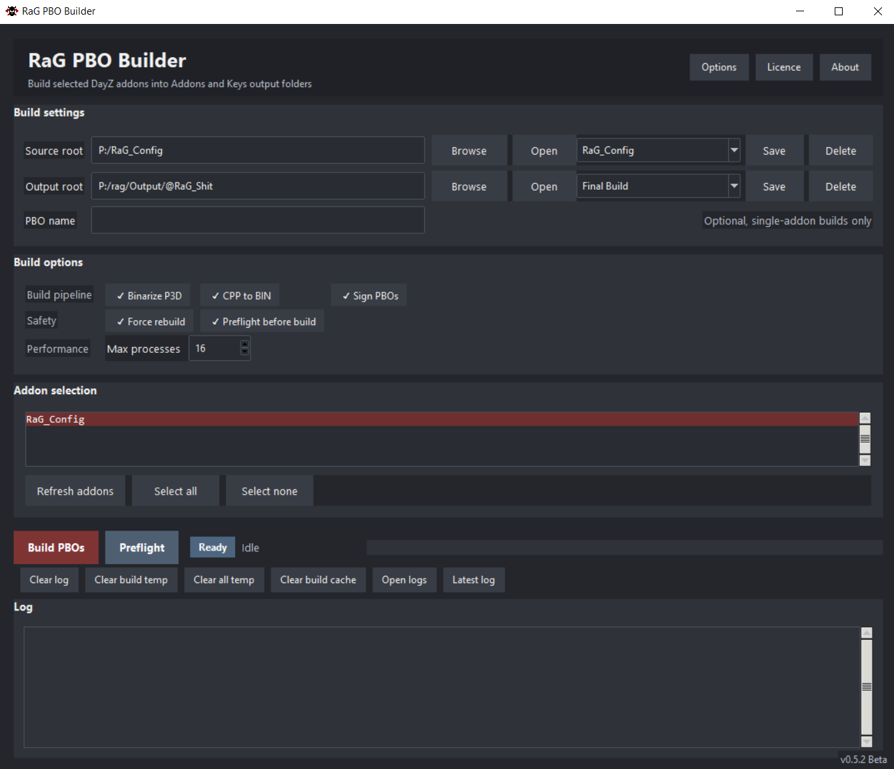
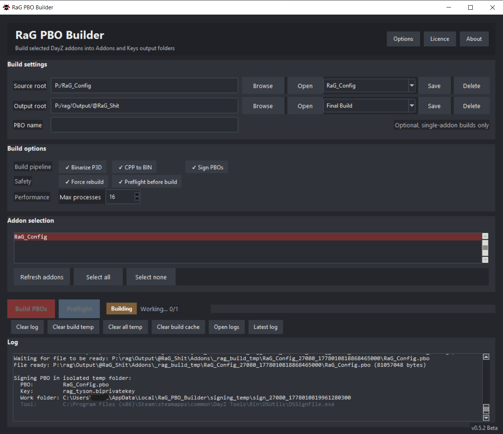
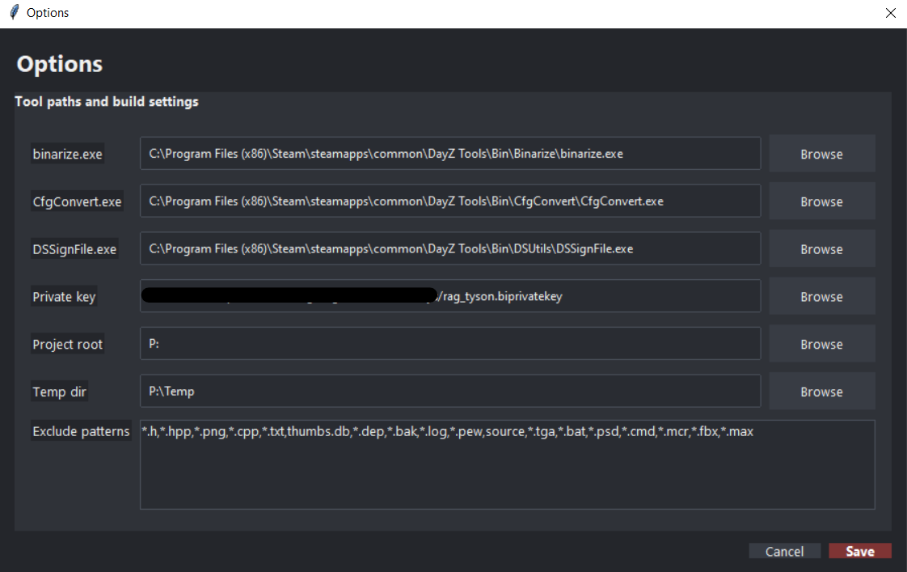

#RaG PBO Builder

Version: 0.1.0 Beta
Author: RaG Tyson
License: Freeware - Proprietary / All Rights Reserved

RaG PBO Builder is a free build tool for DayZ modders.
It helps pack, binarize, convert, sign, check, and organize DayZ addon PBOs.

------------------------------------------------------------
Main Features
------------------------------------------------------------

- Pack selected addon folders into .pbo files
- Build one addon or multiple addons at once
- Binarize .p3d files with DayZ Tools
- Convert config.cpp files to config.bin
- Support nested config.cpp files inside subfolders
- Sign PBOs with DSSignFile.exe
- Copy the matching .bikey into the Keys folder
- Run preflight checks before building
- Skip unchanged addons to save time
- Use isolated temp folders per addon
- Keep clean Addons and Keys output folders
- Save build logs automatically

------------------------------------------------------------
Output Structure
------------------------------------------------------------

The builder automatically creates this structure:

OutputRoot
|-- Addons
|-- Keys

- .pbo files go into Addons
- .bisign files go into Addons
- .bikey files go into Keys
- Existing .bikey files are not overwritten

------------------------------------------------------------
Requirements
------------------------------------------------------------

- Windows
- DayZ Tools installed
- binarize.exe from DayZ Tools
- CfgConvert.exe from DayZ Tools
- DSSignFile.exe from DayZ Tools, if signing is enabled
- A .biprivatekey file, if signing is enabled

Python is not required when using the compiled .exe version.

------------------------------------------------------------
Basic Usage
------------------------------------------------------------

1. Start RaG_PBO_Builder.exe
2. Select your Source root
3. Select your Output root
4. Open Options and check the DayZ Tools paths
5. Select your .biprivatekey if you want to sign PBOs
6. Select the addon or addons you want to build
7. Click Build PBOs

Optional:
- Use Preflight to check configs and referenced paths before building
- Enable Preflight before build if you want checks to run automatically
- Use Force rebuild if you want to ignore the build cache
- Use Clear cache if only selected addons should be rebuilt later

------------------------------------------------------------
Important Key Warning
------------------------------------------------------------

Never share your .biprivatekey.
Only distribute the matching .bikey.

Your .biprivatekey is private and should stay on your own machine.
The .bikey is the public key that can be shared with server owners or included
in a mod release.

------------------------------------------------------------
Preflight Check
------------------------------------------------------------

Preflight can check:

- config.cpp syntax
- nested config.cpp files
- missing referenced files
- path casing issues
- missing textures
- missing materials
- missing models
- missing sounds
- readable internal .p3d references

Supported reference types include:

.paa
.rvmat
.p3d
.wss
.ogg
.cfg
.cpp
.hpp
.h
.emat
.edds
.ptc

Internal P3D scanning is a best-effort scan.
It is not a full replacement for Mikero Tools or PBOProject.

------------------------------------------------------------
Temp Folder Handling
------------------------------------------------------------

RaG PBO Builder uses isolated temp folders per addon.

Example:

Temp
|-- addons
    |-- RaG_BaseBuilding
    |   |-- staging
    |   |-- binarized
    |   |-- textures
    |
    |-- RaG_Config
        |-- staging
        |-- binarized
        |-- textures

Force rebuild only refreshes temp folders for selected addons.
Other addon temp folders are not deleted.

------------------------------------------------------------
Licence
------------------------------------------------------------

RaG PBO Builder is freeware, but it is not open source.

You may use it free of charge for personal and authorized DayZ modding purposes.

You may not sell, rent, sublicense, reupload, redistribute, modify, decompile,
reverse engineer, publish, or include this software or its source code in another
project without written permission from the author.

See LICENSE.txt for the full license text.

------------------------------------------------------------
Disclaimer
------------------------------------------------------------

This tool is provided as-is without warranty.

The author is not responsible for damaged files, lost data, invalid PBOs, failed
builds, server issues, broken signatures, leaked keys, or any other damage caused
by the use or misuse of this software.
